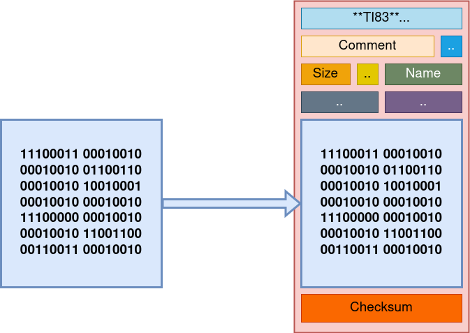

# Bin8x
`bin8x` is a "binary packer" for **ti8x** (ti82, ti83, ti83+, ti84+ etc...) serie.

A "binary packer" is a tool that you would need to wrap assembly (or C) compiled z80 code into a binary that can be transferred to a calculator.

## Usage
`bin8x -i test.bin -o TEST.8xp`

OR

`bin8x test.bin TEST.8xp`

## Credits
The main author of `bin8x` was (and still is) [Peter Martijn Kuipers](https://www.ticalc.org/archives/files/authors/41/4152.html). Current maintainer is [Thibault Duponchelle](https://www.ticalc.org/archives/files/authors/111/11146.html). 

Several other people helped to improve (or even release 1.x versions):
- [Tijl Coosemans](https://www.ticalc.org/archives/files/authors/46/4619.html)
- [Guillaume Hoffmann](https://www.ticalc.org/archives/files/authors/74/7492.html)
- [Julien Solignac](https://www.ticalc.org/archives/files/authors/25/2551.html)

See [history](https://github.com/thibaultduponchelle/bin8x/blob/master/history/README.md) or [ARCHIVE.md](https://github.com/thibaultduponchelle/bin8x_improved/blob/master/ARCHIVE.md) for more informations.

## Notes
I initially used the name [bin8x_improved](https://www.ticalc.org/archives/files/fileinfo/445/44595.html) on [ticalc.org](https://www.ticalc.org/) to differenciate (keeping attributions to same group of people than previous versions, since it's something we can do in ticalc :+1:). 

In 2023, I renamed this repository and I now start using `bin8x` name.

